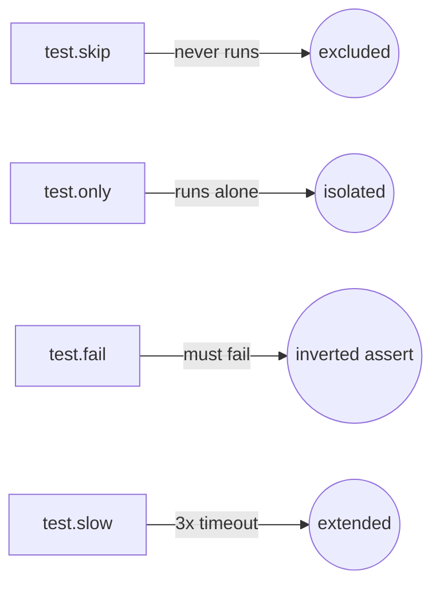
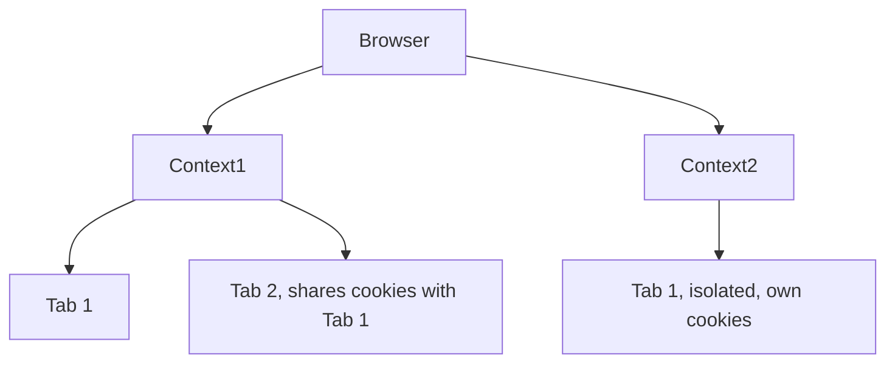

# Learning Playwright Fundamentals 2x

A hands-on starter project for learning [Playwright](https://playwright.dev/) end-to-end testing with TypeScript. This repository contains course-based examples for **The Testing Academy** Playwright Fundamentals journey, covering basics, locators, assertions, browser-context-page concepts, web tables, frames, keyboard interactions, alerts, SVG, shadow DOM, file upload/download, and reporting.

## What You’ll Find Here

- Core Playwright test anatomy and annotations
- Browser → Context → Page (BCP) examples
- Locator strategies and common commands
- Advanced UI interaction examples
- Project-style specs and reusable test patterns
- Allure reporting and HTML reporting setup

## Tech Stack

- [Playwright Test](https://playwright.dev/docs/intro) `^1.61.1`
- TypeScript / Node.js (`@types/node`)

## Prerequisites

- [Node.js](https://nodejs.org/) 18+ (LTS recommended)
- npm (ships with Node)

## Getting Started

```bash
# 1. Install dependencies
npm install

# 2. Install Playwright browsers
npx playwright install
```

## Running Tests

```bash
# Run all tests
npx playwright test

# Run a single spec in root tests/
npx playwright test tests/example.spec.ts

# Run a single spec inside LearningPlaywrightFundamentals2x/tests/
npx playwright test "LearningPlaywrightFundamentals2x/tests/07_WebTables/Task2_19thjuly.spec.ts"

# Run headed mode (watch the browser)
npx playwright test --headed

# Run in UI mode (interactive)
npx playwright test --ui

# Debug a test
npx playwright test --debug
```

## Viewing the Report

After a run, open the HTML report:

```bash
npx playwright show-report
```

## Project Structure

```
.
├── LearningPlaywrightFundamentals2x/
│   └── tests/                        # Extended course exercises
├── tests/
│   ├── 01_Basics/                    # Test anatomy, annotations (skip/only/fail/slow)
│   ├── 02_First_tests/               # Browser → Context → Page (BCP) hierarchy
│   ├── 03_Locators_Commands/ … 23_Advance_Framework/   # Curriculum modules (scaffolded, WIP)
│   ├── Template.spec.ts              # Empty spec scaffold, copy for new tests
│   └── example.spec.ts               # Sample: title check + "Get started" navigation
├── playwright.config.ts              # Single consolidated Playwright configuration
├── package.json
└── .gitignore
```

## What's Inside

`tests/example.spec.ts` demonstrates two core patterns:

1. **Assertions** — verify the page title matches `/Playwright/`.
2. **Navigation + role locators** — click the *Get started* link and assert the *Installation* heading is visible.

### 01 - Test Anatomy & Annotations

**Concept:** every Playwright spec is `test(name, async ({ page }) => {...})`: `page` is a fixture, injected fresh per test, not something you create. Annotations (`.skip`, `.only`, `.fail`, `.slow`) tag a test's execution mode without touching its body.

**Why:** during dev you constantly need to isolate one test (`.only`), silence a broken one (`.skip`), or flag a known-fail (`.fail`), without commenting code out.

**Q&A: why use this?**
- **Q: What breaks if `test.only` ships to CI?** A: Every other test in that run gets skipped, most CI configs (`forbidOnly: !!process.env.CI`) fail the build to catch this.
- **Q: `.skip` vs `.fail`?** A: `.skip` never runs the test. `.fail` runs it and expects a failure, flips to an error if it unexpectedly passes.
- **Q: Can I skip conditionally?** A: Yes, `test.skip(condition, reason)` inside the test body, e.g. skip only on `firefox`.



```ts
// Conditional skip, reads browserName from the fixture
test('conditional', async ({ page, browserName }) => {
    test.skip(browserName === 'firefox', 'Not supported in Firefox');
});
```

### 02 - Browser, Context, Page (BCP) Hierarchy

**Concept:** Playwright models automation in three nested layers: one **Browser** process, many **Contexts** (isolated sessions, like separate incognito windows), each with many **Pages** (tabs). Cookies/storage never leak across contexts; pages in the same context share them.

**Why:** testing multi-user flows (admin + guest, two logged-in accounts) needs real session isolation, launching a whole new browser per user is wasteful; a new context is cheap and isolated.

**Q&A: why use this?**
- **Q: When do I need a second context instead of a second page?** A: When the two sessions must NOT share cookies/auth, e.g. admin vs. viewer logged in simultaneously.
- **Q: Does the `test()` fixture give me a context for free?** A: Yes, `{ page }` already comes with its own context. Use `{ browser }` when a test needs to spin up *extra* contexts manually.
- **Q: What's the cleanup order?** A: Reverse of creation: close pages, then contexts, then the browser.



```ts
test("two users interact", async ({ browser }) => {
    const adminContext = await browser.newContext();
    const adminPage = await adminContext.newPage();

    const guestContext = await browser.newContext();
    const guestPage = await guestContext.newPage();

    await adminPage.goto("https://app.vwo.com/#login");
    await guestPage.goto("https://app.vwo.com/#dashboard/home");

    await adminContext.close();
    await guestContext.close();
});
```

Context options (`viewport`, `locale`, `timezoneId`, `geolocation`, or a full device profile like `userAgent` + `isMobile` for mobile emulation) are passed into `browser.newContext({...})`, see [`237_BCP_Test_Options.spec.ts`](tests/02_First_tests/237_BCP_Test_Options.spec.ts).

### 03 - Locators & Commands

**Concept:** a locator (`page.locator(...)`) does not find the element immediately, it is a lazy, re-queryable reference. Playwright resolves it fresh at action time and auto-waits (strict mode: exactly one match, or it throws) until the element is actionable.

**Why:** DOM elements re-render (React/Vue re-mount, AJAX swaps content); a locator that re-queries on every action survives that churn, unlike a one-time `document.querySelector` handle.

**Q&A: why use this?**
- **Q: What is "strict mode"?** A: `locator()` throws if a selector resolves to more than one element, forcing you to narrow the selector instead of silently acting on the first match.
- **Q: CSS selector cheat sheet?** A: `#id` for id, `.class` for className, `[name="value"]` for the name attribute, bare `tag` for a tag selector.
- **Q: Why does `.fill()` succeed without a manual wait?** A: Auto-wait, Playwright polls the element until visible, enabled, and stable before firing the action.

```mermaid
flowchart LR
    A[page.locator&#40;selector&#41;] -->|lazy, no DOM query yet| B{Action called: .fill&#40;&#41;, .click&#40;&#41;}
    B --> C[Resolve selector now]
    C --> D{Strict mode: 1 match?}
    D -->|No| E[Throw]
    D -->|Yes| F[Auto-wait: visible, enabled, stable]
    F --> G[Perform action]
```



```ts
test("TC#1 - Verify VWO login error with lazy, strict, and auto-wait", async ({ page }) => {
    await page.goto("https://app.vwo.com/#login");

    const userNameField = page.locator('#login-username');
    const passwordField = page.locator("#login-password");
    const loginButton = page.locator("#js-login-btn");

    await userNameField.fill("admin@admin.com");
    await passwordField.fill("pass123");
    await loginButton.click();

    const error_message = page.locator('#js-notification-box-msg');
    await expect(error_message).toContainText("Your email, password, IP address or location did not match");
});
```

## Configuration Highlights

Defined in `playwright.config.ts`:

- `testDir: '.'` — search from repository root
- `testMatch: ['**/*.spec.ts']` — includes both root and nested spec trees
- `fullyParallel: true` — run test files in parallel
- `reporter: 'html'` — generate an HTML report
- `trace: 'on'`, `screenshot: 'on'`, `video: 'on'` — full debug artifacts for every run (heavier, dial back for CI)
- `headless: false`, `viewport: 1920x1080` — headed by default in config
- Projects: Chromium active
- CI-aware retries and workers (`process.env.CI`)

## Learn More

- [Playwright Docs](https://playwright.dev/docs/intro)
- [The Testing Academy](https://thetestingacademy.com/)

## License

ISC
